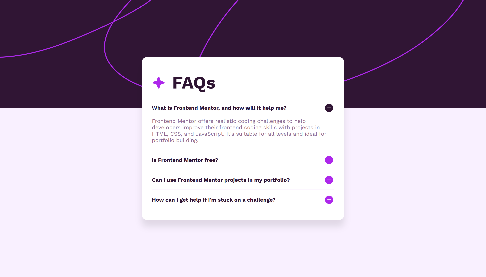

# Frontend Mentor - FAQ accordion solution

This is a solution to the [FAQ accordion challenge on Frontend Mentor](https://www.frontendmentor.io/challenges/faq-accordion-wyfFdeBwBz). 

## Table of contents

- [Overview](#overview)
  - [The challenge](#the-challenge)
  - [Screenshot](#screenshot)
  - [Links](#links)
- [My process](#my-process)
  - [Built with](#built-with)
  - [What I learned](#what-i-learned)
- [Author](#author)

## Overview

### The challenge

Users should be able to:

- Hide/Show the answer to a question when the question is clicked
- Navigate the questions and hide/show answers using keyboard navigation alone
- View the optimal layout for the interface depending on their device's screen size
- See hover and focus states for all interactive elements on the page

### Screenshot

### Links

- Solution URL: [Add solution URL here](https://your-solution-url.com)
- Live Site URL: [GitHub Pages](https://1krasyuk.github.io/FAQ-accordion/)

## My process

### Built with

- Semantic HTML5 markup
- CSS custom properties
- Basic JavaScript 

### What I learned

In this project I mainly focused on practice rather than learning something completely new.  
It was a good chance to refresh and recall some basic concepts:

- Structuring a small project with semantic HTML and clean CSS.
- Using CSS custom properties for consistent styling.
- Implementing a simple accordion interaction with JavaScript (`max-height` + `opacity` transition).
- Practicing responsive design (desktop → mobile).

This challenge was more about building confidence with the basics and completing a full workflow from coding to deployment.

## Author

- Frontend Mentor - [@1krasyuk](https://www.frontendmentor.io/profile/1krasyuk)
- Twitter (X) - [@1krasyuk](https://x.com/1krasyuk)

**Note: Delete this note and add/remove/edit lines above based on what links you'd like to share.**

